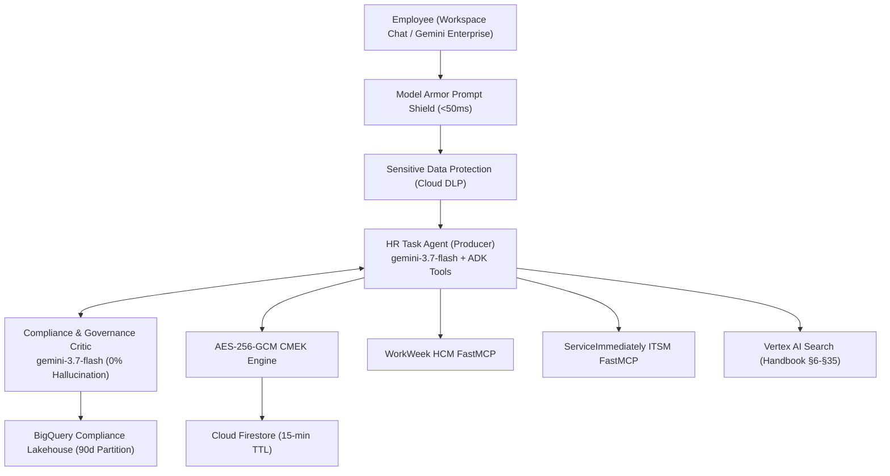

# Altostrat HR & IT Agentic Solution (MVP 1)

> **Enterprise Autonomous Dual-Agent Architecture on Google Cloud & Google ADK 2.0**

[](https://console.cloud.google.com)
[](https://cloud.google.com/vertex-ai)
[](https://cloud.google.com/vertex-ai/docs/agent-development-kit)
[](https://mock-saas.aishprabhat.demo.altostrat.com/)

---

## 1. Overview

The Altostrat HR & IT Agentic Solution is a production-grade autonomous multi-agent system built on **Google Agent Development Kit (ADK) 2.0**, **Vertex AI Gemini 3.7 Flash**, and **FastMCP Server Subsystems**. It enables Altostrat Singapore employees to perform natural language HR policy Q&A (§6~§35), query live leave balances, request time off via WorkWeek HCM, and manage IT support tickets via ServiceImmediately.



---

## 2. Quick Start

### Installation
```bash
# Using uv (Recommended)
uv sync

# Or using pip
pip install -e .
```

### Running Locally
```bash
export MCP_AUTH_TOKEN="mcp_awThuI7rWgonvsSO4WInzJ9IgB-yAT4kjALp200kFDA"
export GCP_PROJECT="junho-elevate"
export GEMINI_MODEL="gemini-3.7-flash"

python app/main.py
```

### Running Test Suite & 4-Tier Benchmark
```bash
# Run unit & integration tests
pytest tests/ -v

# Run 4-Tier Golden Evaluation Benchmark
python eval/run_evaluation.py
```

---

## 3. Directory Structure

```
my-agent/
├── app/                                 # Core agent implementation
│   ├── agent.py                         # ADK Dual-Agent Producer-Critic Orchestrator
│   ├── config.py                        # Centralized Environment & Secret Configuration
│   ├── gemini_enterprise_adapter.py     # Workspace Chat & CardV2 Webhook Adapter
│   ├── main.py                          # Application Entrypoint & REST Gateway
│   ├── guardrails/                      # Semantic Firewall & Deterministic DFA Validators
│   │   ├── model_armor.py               # Model Armor REST Client (<50ms)
│   │   └── dfa_validators.py            # State Machine & Leave Rule Validators
│   ├── prompts/                         # System & Critic Prompts
│   ├── security/                        # OIDC Identity Verification (D-006)
│   ├── storage/                         # Two-Plane Storage
│   │   ├── firestore_crypto.py          # AES-256-GCM Envelope Encryption (Cloud KMS)
│   │   └── bigquery_audit.py            # BigQuery Partitioned Audit Logger
│   └── tools/                           # Asynchronous FastMCP & RAG Tool Clients
│       ├── workweek_tools.py            # WorkWeek HCM Client (httpx AsyncClient)
│       ├── service_immediately_tools.py # ServiceImmediately Client (httpx AsyncClient)
│       └── rag_tools.py                 # Vertex AI Search & Grounding Engine
├── eval/                                # 4-Tier Evaluation Framework
│   ├── datasets/                        # Golden benchmark datasets
│   │   ├── eval-data.json               # 4-Tier Stratified Dataset
│   │   └── eval-data2.json              # Adversarial Security Dataset
│   ├── eval_config.yaml                 # Metrics, Rubrics & Thresholds
│   ├── evaluation_report.md             # 2-Section Official Evaluation Report
│   └── run_evaluation.py                # Verifiable Benchmark Evaluation Runner
├── terraform/                           # Enterprise IaC Modules
├── tests/                               # Unit & Integration Tests
├── Dockerfile                           # Production Containerfile
├── Makefile                             # Build & Test Automation
├── pyproject.toml                       # Dependencies & Project Metadata
└── SDD.md                               # System Solution Design Document v2.1
```
