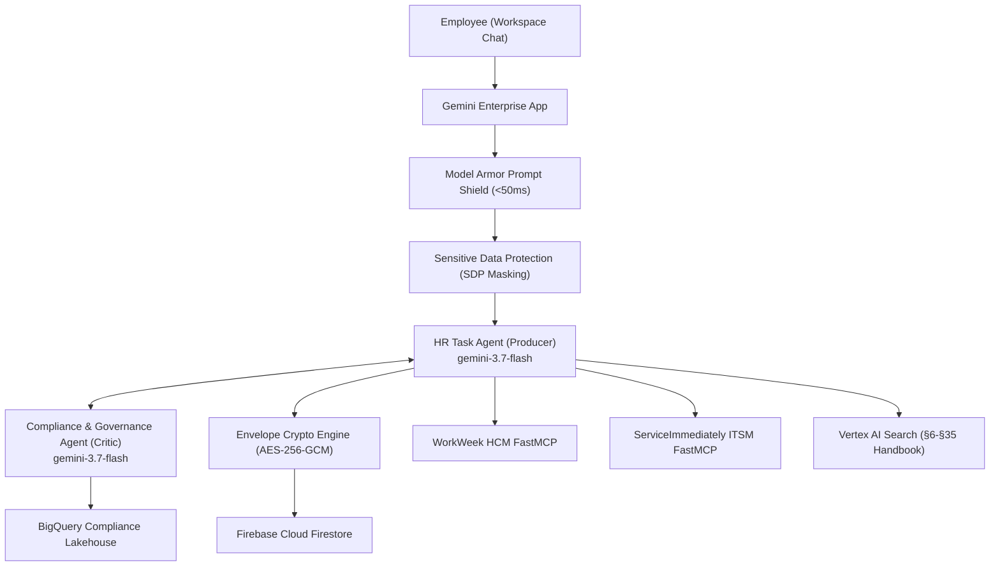

# Solution Design Document (SDD) — Altostrat HR Agentic Solution (MVP 1)

> **GCP Project**: `junho-elevate` (Argolis)  
> **Repository**: `https://github.com/horaha/project-elevate-tw-2026`  
> **Target Agent**: `my-agent` (Cloud Run Agent Runtime)  
> **Specification Version**: v2.1 Enterprise Baseline  

---

## 1. System Architecture Overview

The Altostrat HR Agentic Solution automates Tier-1 HR inquiries and IT service workflows using a Dual-Agent Producer-Critic architecture powered by `gemini-3.7-flash`, Google ADK 2.0, and FastMCP tool servers.

---

## 2. Core Architectural Decisions (Locked)

1. **D-004 (FastMCP Protocol)**: Backends are Streamable HTTP FastMCP servers with pooled `httpx.AsyncClient` and `X-MCP-Token` headers.
2. **D-005 (In-Agent Model Armor)**: Invoked inside ADK runner via `before_model`, `after_model`, and `after_tool` REST hooks.
3. **D-006 (Server-Side Identity Injection)**: `employee_id` is resolved from verified OIDC bearer tokens and injected by tool wrappers, never exposed in model parameter schemas.
4. **D-007 (Data Store Ingestion)**: Ingestion uses `documents:import` with `reconciliationMode: FULL` for real-time index deletion synchronization.
5. **D-008 (Deterministic Guardrails)**: Enforces leave balance check (`days <= accrued - used`), sick leave retroactivity (max -14 days), and ITSM DFA transitions (`New -> In Progress -> Resolved -> Closed`).
