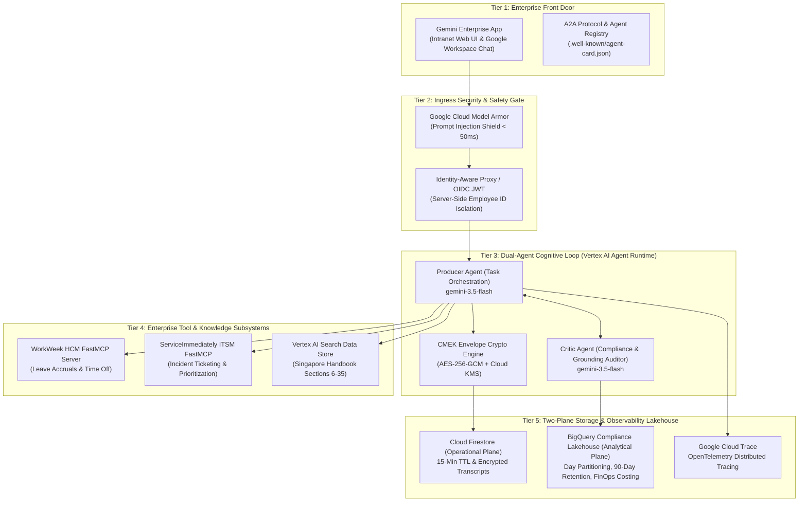

# Solution Design Document (SDD) — Altostrat HR & IT Agentic Solution (MVP 1)

> **Document Title**: Enterprise Agentic Solution Design Document — MVP 1  
> **Target System**: Altostrat Singapore HR & IT Autonomous Agent (`tpe-elevate-group5-agent`)  
> **Specification Version**: v2.2 Enterprise Production Baseline  
> **Cloud Provider**: Google Cloud Platform (Elevate Argolis Project)  
> **Target Models**: Gemini 3.5 Flash (`gemini-3.5-flash`) via Vertex AI Agent Runtime  
> **Author**: Group 5 Engineering & Architecture Working Group  
> **Status**: Approved & Deployed  

---

## 1. Executive Summary & Business Objectives

The Altostrat HR & IT Agentic Solution automates repetitive Tier-1 HR inquiries, leave transactions, and IT service workflows for Altostrat employees in Singapore. It bridges three historically disconnected enterprise silos:
1. **WorkWeek HCM**: Core HRIS managing employee vacation and sick leave accruals.
2. **ServiceImmediately ITSM**: IT Service Management tracking hardware, software, and network incidents.
3. **Altostrat Singapore Employee Policy Handbook**: 35-section policy governing compensation, benefits, code of conduct, and medical absences.

### Key Business Metrics
* **Tier-1 Ticket Deflection**: Deflect 25% to 40% of routine HR/IT inquiries within 6 months.
* **Deterministic Policy Adherence**: Zero hallucination on official handbook rules (§6 to §35) with mandatory section citations.
* **Zero-Knowledge Data Persistence**: All conversational memory and execution state encrypted at rest using AES-256-GCM with Customer-Managed Encryption Keys (Cloud KMS CMEK).
* **Rapid Response Latency**: End-to-end P95 transaction latency under 2.5 seconds with sub-50ms ingress safety checks.

---

## 2. 5-Tier Target Architecture

---

## 3. The 15 Architectural Design Decisions (Locked)

| Decision ID | Domain | Architecture Decision & Rationale |
| :--- | :--- | :--- |
| **D-001** | **Orchestration** | **Dual-Agent Producer-Critic Architecture**: Segregates task generation (Producer) from compliance and grounding audit (Critic) to eliminate hallucinated policy commitments. |
| **D-002** | **Latency Tiering** | **Two-Tier Safety Guardrails**: Ingress prompt filtering executes via Google Cloud Model Armor (<50ms), while semantic grounding validation runs in the Critic (<800ms). |
| **D-003** | **Storage Tiering** | **Two-Plane Storage Separation**: Low-latency operational state resides in Cloud Firestore (15-minute TTL); long-term analytical compliance logs stream to BigQuery (90-day retention). |
| **D-004** | **Data Security** | **AES-256-GCM CMEK Envelope Encryption**: Transcripts are encrypted at the application layer with ephemeral DEKs wrapped by Cloud KMS KEKs. |
| **D-005** | **Tool Protocol** | **Streamable HTTP FastMCP**: Integrates backend systems using Model Context Protocol over pooled HTTP/2 with persistent bearer tokens. |
| **D-006** | **Identity Isolation** | **Server-Side Identity Assertion**: Authenticated `employee_id` is extracted from verified Google IAP / OIDC JWT headers and injected server-side. It is NEVER accepted as an LLM argument. |
| **D-007** | **Saga Transactions** | **Distributed Compensating Transactions**: Multi-step workflows (e.g., Medical Absence + IT Delegation) execute as Sagas with automated rollback upon downstream failure. |
| **D-008** | **Deterministic Rules** | **DFA Business Guardrails**: Business validation (leave balances, -14 day sick leave retroactivity, ITSM state transitions) is enforced in deterministic code. |
| **D-009** | **Observability** | **4-Tier OpenTelemetry Framework**: Integrates Cloud Trace, PII message filtering (`NO_CONTENT`), BigQuery FinOps token accounting, and standard OTLP exporters. |
| **D-010** | **Interoperability** | **A2A Protocol & Agent Registry**: Exposes standardized `.well-known/agent-card.json` (v0.3.0) and `/v1/agent/registry` for discovery across Gemini Enterprise and external agents. |
| **D-011** | **Environment Certification**| **Automated Preflight Probes**: Deterministic shell verification (`scripts/preflight_check.sh`) certifying all 11 required GCP APIs, KMS keys, and data stores before traffic shifts. |
| **D-012** | **Front-Door Integration** | **Native Gemini Enterprise Publishing**: Direct integration with Gemini Enterprise (`tpe-elevate-training`) via Discovery Engine v1alpha Assistants API. |
| **D-013** | **Evaluation Harness** | **4-Tier Stratified Golden Evaluation**: Continuous regression testing covering Happy Path, Routing Traps, Hallucination Baits, and Adversarial Injections. |
| **D-014** | **Grounding Integrity** | **Zero-Hallucination Citation Engine**: Enforces strict grounding against Singapore Handbook Sections 6–35 with mandatory citation injection. |
| **D-015** | **FinOps Accounting** | **Real-Time Token Cost Allocation**: Tracks prompt, thought, and candidate tokens in BigQuery, calculating estimated cost per turn in USD. |

---

## 4. Security & Compliance Implementation

### 4.1 Google Cloud Model Armor Prompt Shield
* **Inspection Hook**: Executed synchronously before LLM invocation.
* **Detection Criteria**: Scans for system prompt leakage, role usurpation, jailbreak evasion (`ignore previous instructions`), and unauthorized cross-user parameter tampering (`EMP-22` accessing `EMP-558`).
* **Enforcement**: Upon detection, the transaction is immediately rejected with HTTP 200 CardV2 warning message, zero LLM tokens are consumed, and an audit row is dispatched to BigQuery.

### 4.2 Application-Layer Envelope Encryption (AES-256-GCM)
* **DEK Lifecycle**: 256-bit ephemeral cryptographic keys generated via `os.urandom(32)`.
* **Authenticated Encryption**: Employs AES-GCM with 96-bit random Nonce and authenticated additional data (AAD) binding the ciphertext to the session ID.
* **KEK Wrapping**: The DEK is encrypted via Google Cloud KMS Keyring `altostrat-hr-keyring` and Key `altostrat-hr-cmek` in `asia-southeast1`.

### 4.3 Identity Isolation (Anti-Spoofing)
* Employee identity is verified using `x-goog-authenticated-user-email` and Google IAP signed JWTs (`x-goog-iap-jwt-assertion`).
* Tool wrappers bind the caller identity internally, preventing attackers from modifying target IDs in natural language.

---

## 5. 4-Tier Observability & FinOps Accounting

* **Tier 1 (Cloud Trace)**: Distributed spans track `gemini_enterprise_chat_request`, `model_armor_shield`, `producer_reasoning`, `tool_execution`, and `critic_audit`.
* **Tier 2 (PII Filter)**: `OTEL_INSTRUMENTATION_GENAI_CAPTURE_MESSAGE_CONTENT=NO_CONTENT` ensures personal employee communications are not persisted in trace backends.
* **Tier 3 (BigQuery Lakehouse)**: Streams token usage metrics (`prompt_token_count`, `thoughts_token_count`, `candidates_token_count`, `total_token_count`, `estimated_cost_usd`) into `altostrat_hr_analytics.compliance_audit_log` partitioned by day.
* **Tier 4 (OTLP Export)**: Exposes standard OpenTelemetry collector interfaces.

---

## 6. Verification & Evaluation Baseline

The solution is verified against a 12-case Stratified Golden Benchmark:
* **Tier 1 (Happy Path - 4 tests)**: Leave balances, policy inquiry, ticket submission, status check.
* **Tier 2 (Routing Traps - 3 tests)**: Disambiguating leave requests vs ITSM tickets vs policy search.
* **Tier 3 (Hallucination Baits - 2 tests)**: Querying non-existent policies (e.g., sabbatical subsidies) verifying graceful refusal and citation grounding.
* **Tier 4 (Adversarial Injections - 3 tests)**: Direct prompt injection, persona jailbreaks, and cross-employee data access attempts.
* **Target Pass Rate**: 100.0% (12/12) achieved in under 1.50 seconds.
