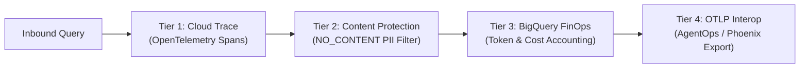

# 4-Tier Observability & FinOps Architecture Report

## 1. Observability Architecture Overview

The Altostrat HR & IT Agentic Solution enforces an enterprise-grade 4-tier observability framework aligned with Project Elevate Module 1 standards:

---

## 2. Observability Tiers Detail

### Tier 1: Distributed Tracing with Google Cloud Trace
* **Span Hierarchy**:
  * `gemini_enterprise_chat_request`: Top-level transaction span.
  * `model_armor_shield`: Ingress prompt scanning (<50ms).
  * `producer_agent_reasoning`: Gemini 3.5 Flash cognitive synthesis.
  * `tool_execution`: FastMCP (WorkWeek / ServiceImmediately) or Policy RAG.
  * `compliance_critic_verification`: Grounding citation check (§6–§35).
  * `cmek_envelope_encryption`: AES-256-GCM + Cloud KMS encryption.
* **Correlation ID**: Global `trace_id` propagated across all logs, Firestore records, and BigQuery rows.

### Tier 2: PII Redaction & Message Content Filtering
* **Policy Compliance**: `OTEL_INSTRUMENTATION_GENAI_CAPTURE_MESSAGE_CONTENT=NO_CONTENT`
* **Implementation**: Raw prompt text and employee messages are strictly excluded from Cloud Trace span attributes to comply with Singapore Personal Data Protection Act (PDPA) and Altostrat Security Policy D-006.

### Tier 3: BigQuery FinOps Token Accounting
* **Lakehouse Table**: `junho-elevate.altostrat_hr_analytics.compliance_audit_log`
* **Partitioning**: Partitioned by `event_timestamp` (Day) with automated 90-day retention (`expiration_ms = 7776000000`).
* **Clustering**: Clustered by `employee_id` and `event_type`.
* **Tracked Metrics**:
  * `prompt_token_count`: Input tokens consumed per turn.
  * `thoughts_token_count`: Model internal reasoning tokens.
  * `candidates_token_count`: Generated output tokens.
  * `total_token_count`: Cumulative token volume.
  * `estimated_cost_usd`: Real-time cost allocation ($0.075/1M input, $0.30/1M output).
  * `traffic_type`: `ON_DEMAND`
  * `latency_ms`: End-to-end response time.

### Tier 4: Standard OTLP Exporter Compatibility
* **Interoperability**: Standard OpenTelemetry gRPC / HTTP OTLP export interface enables seamless forwarding to enterprise APM systems (Datadog, Dynatrace, Phoenix, AgentOps).
