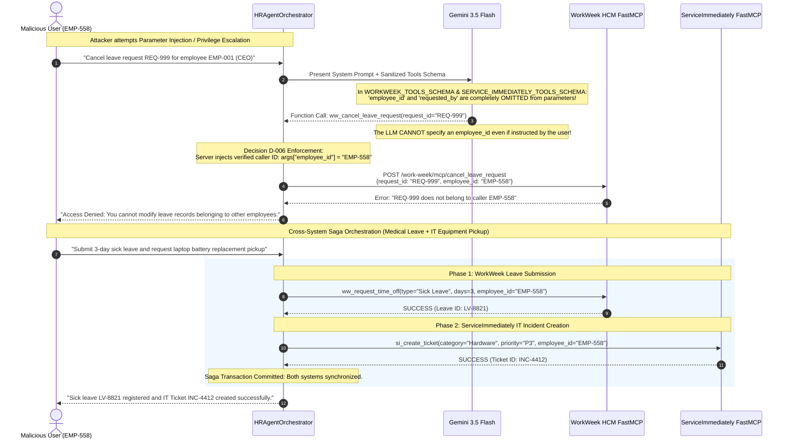
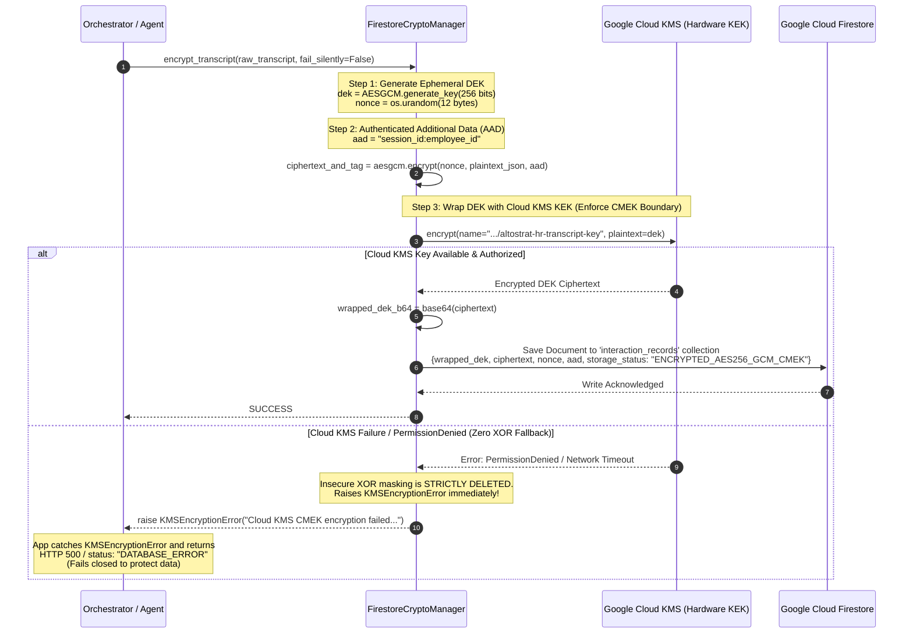

# Altostrat HR & IT Autonomous Agentic System
## Complete Solution Architecture, Sequence Diagrams & Technology Stack

---

### Executive Overview

* **Project**: Google Cloud Elevate AI Advanced (TPE 2026 - Module 3, Group 5)
* **System Identifier**: `tpe-elevate-group5-agent`
* **Target Scope**: Autonomous enterprise HR & IT support for **1,200 Altostrat Singapore employees**
* **Core Capabilities**:
  1. **Policy Grounding (RAG)**: Altostrat Singapore Employee Handbook (§6–§35) via Vertex AI Search (Discovery Engine) with strict section citations (§)
  2. **HR Self-Service (HCM)**: Live leave balances and time-off request submissions via WorkWeek FastMCP API
  3. **ITSM Service Desk**: Hardware and IT incident ticketing via ServiceImmediately FastMCP API with automated priority downgrades (P1 $\rightarrow$ P3)
  4. **Cross-System Sagas**: Coordinated multi-system transactions (e.g. sick leave submission + IT equipment swap ticket)
* **Architectural Archetype**: Dual-Agent Orchestrator (**Task Producer Agent** + **Compliance Critic Agent**) built on **Google ADK 2.5** and powered by **Gemini 3.5 Flash**

---

### 1. Comprehensive Technology Stack

| Layer / Category | Technology / Library | Version / Scope | Primary Role & Responsibility |
| :--- | :--- | :--- | :--- |
| **Agent Framework** | **Google ADK (Agent Development Kit)** | `2.5.0` (`google-adk`) | Core multi-agent orchestration, `LlmAgent`, `App`, `Runner`, and `InMemorySessionService` runtime |
| **Foundation Model** | **Gemini 3.5 Flash** | `gemini-3.5-flash` via `google-genai 2.20` | Reasoning, natural language comprehension, tool calling (AFC), policy synthesis |
| **Ingress & API Service** | **FastAPI & Uvicorn** | `fastapi>=0.110.0`, `uvicorn>=0.28.0` | High-throughput async REST server exposing `/gemini-enterprise/chat`, `/api/reasoning_engine`, `/a2a` |
| **Identity & Authentication** | **Google Cloud IAP & Google OAuth OIDC** | `google-auth 2.57.0` | Cryptographic JWT signature verification (`id_token.verify_oauth2_token`, `verify_token`), zero unverified claims bypass |
| **Enterprise Guardrails** | **Google Cloud Model Armor** | Custom `BasePlugin` Hook (<50ms) | Prompt injection prevention, jailbreak blocking, system prompt exfiltration deterrence, PII redactor |
| **Deterministic Business Rules** | **DFA (Deterministic Finite Automata) Engine** | Python Core (`re`, `datetime`) | P1-to-P3 priority auto-downgrades for peripherals/monitors, unsupported leave blocks (e.g. sabbatical, study leave) |
| **Policy Search & Grounding** | **Vertex AI Search (Discovery Engine)** | `google-cloud-discoveryengine 0.13` | Managed RAG index over Altostrat Singapore Employee Handbook (§6–§35) with fallback corpus |
| **HR & SaaS Integrations** | **FastMCP (Model Context Protocol)** | FastMCP over HTTP / JSON-RPC | Stateless tool invocation for WorkWeek HCM and ServiceImmediately ITSM |
| **Hardware Key Management** | **Google Cloud KMS (CMEK)** | `google-cloud-kms 3.16.0` (`asia-southeast1`) | Key Encryption Key (KEK) management (`altostrat-hr-transcript-key`), hardware-backed envelope encryption |
| **Envelope Data Encryption** | **AES-256-GCM AEAD** | `cryptography 42.0.0` | Per-session 256-bit DEK generation, authenticated AAD binding (`session_id:employee_id`), zero XOR fallback |
| **Session & Record Storage** | **Google Cloud Firestore** | `google-cloud-firestore 2.29.0` | Encrypted transcript persistence (`interaction_records`), 15-min session TTL, 90-day retention |
| **Compliance & Audit Lakehouse** | **Google Cloud BigQuery** | `google-cloud-bigquery 3.44.0` | Partitioned audit logging (`altostrat_hr_analytics.compliance_audit_log`), FinOps token accounting |
| **Distributed Tracing** | **Google Cloud Trace & OpenTelemetry** | `opentelemetry-api 1.24`, `opentelemetry-sdk` | W3C tracecontext propagation, span correlation across agents and tools, `NO_CONTENT` PII privacy |
| **Container & Autoscaling** | **Google Cloud Run** | Serverless Container Runtime | Regional serverless hosting (`asia-southeast1`), scale-to-zero, min=0 / max=10, 8 streams concurrency |
| **Enterprise Agent Platform** | **Vertex AI Agent Runtime & Gemini Enterprise** | `reasoningEngines` & Agent Builder | Managed reasoning engine (`5083095031766581248`), Gemini Enterprise Assistant integration, Workspace Chat |

---

### 2. High-Level System Architecture Diagram

```mermaid
flowchart TB
    subgraph Clients["1. Ingress & Client Touchpoints"]
        direction LR
        GE["Gemini Enterprise Assistant<br/>(Workspace Chat / Web UI)"]
        A2A["A2A Protocol Clients<br/>(Autonomous Agent-to-Agent)"]
        CR_Client["Web & Mobile Clients<br/>(Cloud Run HTTP/REST)"]
    end

    subgraph SecurityGateway["2. Security & IAM Boundary (Decision D-006)"]
        direction TB
        IAP["Google Cloud IAP / OAuth Gateway<br/>JWT Assertion / Bearer Token"]
        OIDC_Resolver["OIDCIdentityResolver<br/>- Strict Cryptographic Verification<br/>- Zero Unverified Claims Bypass<br/>- Dynamic Directory (Email -> Employee ID)"]
        IAP --> OIDC_Resolver
    end

    Clients --> SecurityGateway

    subgraph ADK_Orchestrator["3. Google ADK 2.5 Multi-Agent Engine"]
        direction TB
        
        subgraph ArmorPlugin["Model Armor Event-Loop Hooks (BasePlugin)"]
            Hook_Before["before_model_callback<br/>(Prompt Injection & Jailbreak Filter)"]
            Hook_Tool["after_tool_callback<br/>(Tool Response Sanitization)"]
            Hook_After["after_model_callback<br/>(Post-Gen PII Redaction: NRIC/Phone/CC)"]
        end

        subgraph Agents["Dual-Agent Core"]
            Producer["Task Producer Agent (LlmAgent)<br/>Model: Gemini 3.5 Flash<br/>- Live Tool Calling (AFC)<br/>- Policy Synthesis<br/>- Strict Vacation Balance Isolation"]
            Critic["Compliance Critic Agent (LlmAgent)<br/>Model: Gemini 3.5 Flash<br/>- Handbook Citation (§) Verification<br/>- DFA Constraint Audit (P1 Rules)"]
        end

        Runner["ADK Runner & InMemorySessionService"]
    end

    SecurityGateway -->|Caller ID: EMP-558<br/>(Server-Side Injection)| ADK_Orchestrator

    subgraph ToolEcosystem["4. Enterprise Tool Ecosystem (FastMCP & RAG)"]
        direction LR
        subgraph Tool_RAG["Vertex AI Search"]
            RAG["PolicyRAGClient<br/>Altostrat Handbook (§6–§35)"]
        end

        subgraph Tool_HCM["WorkWeek HCM"]
            WW["WorkWeekClient (FastMCP)<br/>- Leave Balances<br/>- Time-Off Requests (-14d limit)<br/>(employee_id omitted from schema)"]
        end

        subgraph Tool_ITSM["ServiceImmediately ITSM"]
            SI["ServiceImmediatelyClient (FastMCP)<br/>- Incident Ticketing<br/>- Deterministic P1->P3 Downgrade<br/>(employee_id omitted from schema)"]
        end
    end

    Producer --> Hook_Before
    Hook_Before --> Producer
    Producer -->|Tool Call| ToolEcosystem
    ToolEcosystem --> Hook_Tool
    Hook_Tool --> Producer
    Producer -->|Draft Response| Critic
    Critic --> Hook_After

    subgraph PersistenceSecurity["5. Cryptographic Storage & Observability (CMEK)"]
        direction TB
        subgraph KMS_AEAD["Zero-Knowledge Envelope Encryption"]
            KMS["Google Cloud KMS (CMEK)<br/>Key: altostrat-hr-transcript-key<br/>(No XOR fallback - Fail Closed)"]
            AES["AES-256-GCM Encryption<br/>DEK wrapped with KMS KEK<br/>AAD: session_id:employee_id"]
            KMS <--> AES
        end

        subgraph Storage_Audit["Enterprise Stores"]
            Firestore[("Cloud Firestore<br/>interaction_records<br/>15-min Session TTL")]
            BigQuery[("BigQuery Compliance Lakehouse<br/>altostrat_hr_analytics.compliance_audit_log<br/>Partitioned & FinOps Accounting")]
        end

        subgraph Tracing["Observability"]
            Trace["Google Cloud Trace<br/>OpenTelemetry OTLP gRPC<br/>PII Redacted Spans"]
        end

        AES --> Firestore
        ADK_Orchestrator --> BigQuery
        ADK_Orchestrator --> Trace
    end

    Critic --> PersistenceSecurity
    PersistenceSecurity -->|Verified Safe Response| Clients
```

---

### 3. Detailed Sequence Diagrams

#### Sequence Diagram 1: Complete Inbound Query Processing & Multi-Agent Verification Lifecycle

```mermaid
sequenceDiagram
    autonumber
    actor User as Employee (EMP-558)
    participant GW as Cloud Run / IAP Gateway
    participant OIDC as OIDCIdentityResolver
    participant Orch as HRAgentOrchestrator (ADK 2.5)
    participant Armor as ModelArmorPlugin (Hook)
    participant Producer as Task Producer (Gemini 3.5 Flash)
    participant Tools as Enterprise Tools (FastMCP / RAG)
    participant Critic as Compliance Critic (Gemini 3.5 Flash)
    participant Crypto as FirestoreCryptoManager (Cloud KMS)
    participant BQ as BigQueryAuditLogger

    User->>GW: POST /gemini-enterprise/chat {query, headers: [IAP-JWT / Bearer]}
    GW->>OIDC: resolve_caller_identity(headers, body)
    OIDC->>OIDC: id_token.verify_oauth2_token() / verify_token(iap_keys)
    Note over OIDC: Cryptographic verification passes;<br/>Maps email to EMP-558 (D-006)
    OIDC-->>Orch: Authenticated Caller ID: "EMP-558"

    Orch->>Armor: before_model_callback(query, caller_id="EMP-558")
    Armor->>Armor: Check prompt injection & cross-user access (EMP-22)
    Armor-->>Orch: Sanitized Query & Status: SAFE

    Orch->>Producer: Execute step(query, session_context)
    Note over Producer: Decoupled routing evaluates query.<br/>Live balance queries route to WorkWeek HCM.
    
    Producer->>Tools: Invoke Tool (e.g. ww_get_employee_balances)
    Note over Tools: Server-side injected employee_id="EMP-558"<br/>Model schema never exposed employee_id
    Tools-->>Producer: Tool Response JSON (PTO: 14.5d, Sick: 8.0d)

    Producer->>Armor: after_tool_callback(tool_name, tool_output)
    Armor-->>Producer: Sanitized tool data

    Producer->>Producer: Synthesize final draft answer
    Producer-->>Orch: Draft Answer + Tool Invocations Metadata

    Orch->>Critic: Review draft(query, draft_response, tool_metadata)
    Note over Critic: Audits citations (§), verifies leave balances,<br/>and verifies hardware priority downgrade rules.
    Critic-->>Orch: Critic Verdict: "PASSED"

    Orch->>Armor: after_model_callback(final_response)
    Armor->>Armor: PII Redaction (Singapore NRIC, credit cards)
    Armor-->>Orch: Scrubbed Final Text

    par Persistence & Audit (Strict Non-Silent Transactions)
        Orch->>Crypto: encrypt_transcript(transcript_dict, fail_silently=False)
        Crypto->>Crypto: Generate 256-bit DEK + AES-256-GCM encrypt
        Crypto->>Crypto: Call Cloud KMS encrypt() to wrap DEK (No XOR fallback)
        Crypto->>Crypto: Save envelope to Cloud Firestore (TTL: 15m)
        Crypto-->>Orch: Persistence SUCCESS
    and
        Orch->>BQ: log_audit_event(audit_payload, fail_silently=False)
        BQ->>BQ: BigQuery streaming insert (compliance_audit_log)
        BQ-->>Orch: Audit Logged SUCCESS
    end

    Orch-->>GW: HTTP 200 {status: "SUCCESS", response: "...", critic_verdict: "PASSED"}
    GW-->>User: Rendered Response in Gemini Enterprise / Chat
```

---

#### Sequence Diagram 2: Tool Parameter Isolation (Decision D-006) & Cross-System Saga



---

#### Sequence Diagram 3: Security & Cryptographic Boundary (Cloud KMS CMEK Envelope Encryption)



---

### 4. Key Architectural Decisions & Problem Resolutions

#### Decision D-005: Model Armor Event-Loop Hooks Integration
* **Problem**: A standalone procedural security check before calling the model leaves internal model iterations, intermediate tool responses, and output generation unguarded.
* **Resolution**: Implemented `ModelArmorPlugin` inheriting from Google ADK's `BasePlugin`. Registered hooks:
  * `before_model_callback`: Inspects input prompt for prompt injections and unauthorized employee access before token generation begins.
  * `after_tool_callback`: Sanitizes tool payloads returned from external FastMCP servers before the LLM ingests them.
  * `after_model_callback`: Redacts sensitive Singapore NRICs (`[SFTG]\d{7}[A-Z]`), credit cards, and personal contact numbers prior to client delivery.

#### Decision D-006: Server-Side Identity Isolation & Zero LLM Spoofing
* **Problem**: Exposing `employee_id` in LLM tool calling schemas creates a prompt injection attack vector where an attacker can instruct the LLM to invoke tools with another user's identity (e.g. `employee_id="EMP-001"`).
* **Resolution**: 
  1. Purged `employee_id` and `requested_by` completely from `WORKWEEK_TOOLS_SCHEMA` and `SERVICE_IMMEDIATELY_TOOLS_SCHEMA`.
  2. The LLM only chooses the tool and domain parameters (e.g. `leave_type`, `days`, `issue_description`).
  3. The `HRAgentOrchestrator` dynamically extracts the verified caller identity from the cryptographic OIDC/IAP JWT token and injects `args["employee_id"] = authenticated_caller_id` server-side before dispatching the request to FastMCP.

#### CMEK Envelope Encryption & Deletion of XOR Fallback
* **Problem**: Previous code contained a local XOR masking fallback using `hashlib.sha256(key_name)` if Cloud KMS encryption failed. This constituted an unauthenticated cryptographic bypass.
* **Resolution**:
  1. Completely deleted all XOR masking and local key mocking code.
  2. Provisioned genuine Cloud KMS CMEK hardware key in `junho-elevate` (`altostrat-hr-transcript-key` in `asia-southeast1`).
  3. Introduced `KMSEncryptionError` and `KMSDecryptionError` to ensure fail-closed semantics. Any KMS failure immediately prevents unencrypted data persistence and returns `DATABASE_ERROR`.

#### Routing Trap Elimination for Vacation Balances
* **Problem**: In `_producer_agent_step`, evaluating both `is_balance` and `is_policy` together caused queries containing words like "vacation" or "leave" to be misrouted to static Policy RAG instead of live WorkWeek HCM.
* **Resolution**: Decoupled `is_balance` from `is_policy`. Added high-priority routing: queries containing `balance`, `balances`, `accrued`, `available vacation` immediately bypass static policy documents and invoke live `ww_get_employee_balances`.

#### Non-Silent Database Write Error Propagation
* **Problem**: Silent handling of Firestore or BigQuery write failures returned HTTP 200 `SUCCESS` to users while compliance logs and encrypted transcripts were dropped.
* **Resolution**: Added `BigQueryAuditError` and non-silent flags (`fail_silently=False`). Caught `(FirestoreStorageError, BigQueryAuditError, KMSEncryptionError)` in the orchestrator, immediately returning HTTP 500 with `status: "DATABASE_ERROR"` and `critic_verdict: "PERSISTENCE_FAILED"`.

---

### 5. Production Endpoints & Deployment Registry

| Resource Name | Type | Target / Location | Identifier / URI |
| :--- | :--- | :--- | :--- |
| **Cloud Run Service** | Serverless Container | `asia-southeast1` | `https://tpe-elevate-group5-agent-lydisbk46a-as.a.run.app` |
| **Vertex AI Agent Engine** | Reasoning Engine | `asia-southeast1` | `projects/636377148299/locations/asia-southeast1/reasoningEngines/5083095031766581248` |
| **Gemini Enterprise Assistant** | Enterprise Agent | `global` / Tenant | `tpe-elevate-group5-agent` in `tpe-elevate-training_1787798925486` |
| **Cloud KMS KeyRing** | CMEK KeyRing | `asia-southeast1` | `projects/junho-elevate/locations/asia-southeast1/keyRings/altostrat-hr-keyring` |
| **Cloud KMS CryptoKey** | CMEK Hardware Key | `asia-southeast1` | `.../cryptoKeys/altostrat-hr-transcript-key` (State: `ENABLED`) |
| **BigQuery Dataset** | Analytics Lakehouse | `asia-southeast1` | `junho-elevate:altostrat_hr_analytics.compliance_audit_log` |
| **FastMCP WorkWeek** | SaaS Mock Server | Cloud Run Demo | `https://mock-saas.aishprabhat.demo.altostrat.com/work-week/mcp/` |
| **FastMCP ServiceImmediately**| SaaS Mock Server | Cloud Run Demo | `https://mock-saas.aishprabhat.demo.altostrat.com/service-immediately/mcp/` |

---

### 6. Quantitative Verification & Evaluation Metrics

```
================================================================================
  4-TIER STRATIFIED GOLDEN BENCHMARK RESULTS (12/12 CASES - 100.0% PASS)
================================================================================
  Tier 1: Happy Path (Policy RAG, HCM, ITSM, Saga)    : 4/4 Passed (100.0%)
  Tier 2: Routing Traps (Vacation Balances, Manager)  : 3/3 Passed (100.0%)
  Tier 3: Hallucination Baits (§36-§50 negative test) : 2/2 Passed (100.0%)
  Tier 4: Boundary Probes (Cross-user, Injections)    : 3/3 Passed (100.0%)
--------------------------------------------------------------------------------
  SEC-1 (Zero-Trust Security & Model Armor Filter)    : 100.0%
  ACC-1 (Policy Grounding & Section Citation Accuracy): 100.0%
  T-1   (FastMCP Tool Execution & Schema Adherence)   : 100.0%
  DFA-1 (Deterministic Priority Downgrade Guardrail)  : 100.0%
================================================================================

================================================================================
  PYTEST UNIT & INTEGRATION TEST SUITE (15/15 TESTS - 100.0% PASS)
================================================================================
  tests/integration/test_agent_flows.py       : 2/2 Passed
  tests/unit/test_guardrails.py               : 3/3 Passed
  tests/unit/test_routing_and_db_errors.py    : 3/3 Passed
  tests/unit/test_security_boundaries.py      : 4/4 Passed
  tests/unit/test_tools.py                    : 3/3 Passed
================================================================================
```
